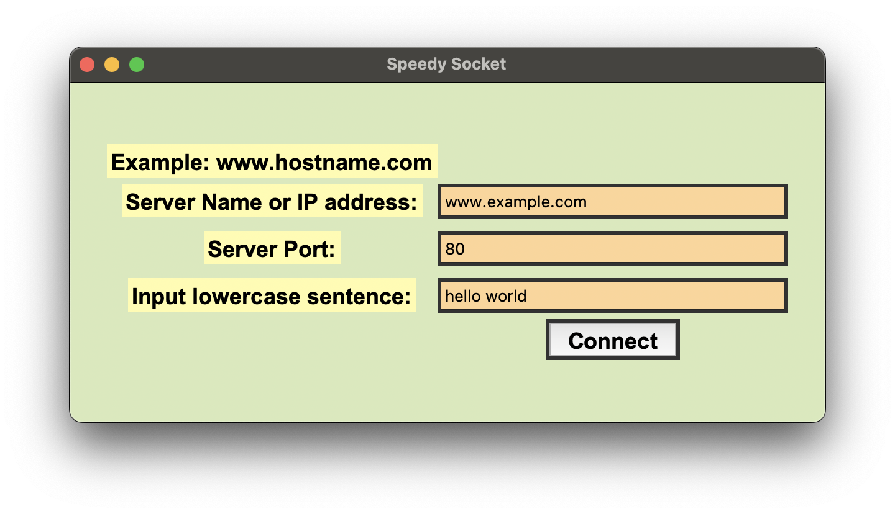

# Speedy Socket

Speedy Socket is a simple program to quickly connect you to a server and port using an easy to use GUI.

### Getting Started

To begin using the program, open the file titled *SpeedSocket.py* and select the run option in your chosen IDE. 

### Prerequisites

To successfully run the code, you must have the following items installed:
- Python 3.x 
- Socket Library
- Tkinter 

### Usage

The GUI window pops up with labels and an entry box for the user to input their server name/IP address, port and lowercase sentence, as well as a "connect" button to start the process. 

### To connect to a server: 
1. Enter the server name or IP address in the designated box.
2. Enter the port.
3. Enter the lowercase sentence you would like to send in the designated box.
4. Press the "Connect" button.

## Contributing

To contribute to the project, feel free to open a pull request or create an issue. 

